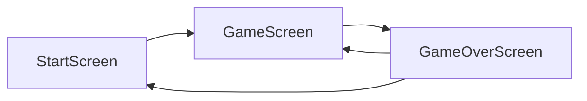

# Vitrac Jam Invader - PixiJS Recreation Plan

## Summary

Port the HTML5 Canvas Jam Invader game from [D:\vitrac-game-example](D:\vitrac-game-example) to the PixiJS project, copying all sprites and assets, connecting to Supabase for the leaderboard, and upgrading visuals/game feel while keeping the neon/space vibe.

---

## Phase 1: Asset Migration

### Copy assets from old project

Copy from `D:\vitrac-game-example\assets\` to `raw-assets/game{m}/`:


| Asset                                                                                    | Purpose              |
| ---------------------------------------------------------------------------------------- | -------------------- |
| strawberry.png, blueberry.png, mango.png                                                 | Enemy sprites        |
| spaceship.png                                                                            | Player ship          |
| bullet.png                                                                               | Player bullets       |
| background.png                                                                           | Game background      |
| logo-vitrac.png                                                                          | Header/logo          |
| Asmaa.png                                                                                | Start screen avatar  |
| Raspberry_1.png, Mango_1_0.png, Carrot_1.png, Blueberry_1.png, bCherry_1.png, Strw_1.png | Product panel images |


**AssetPack setup**: Add `game` bundle to manifest. Use AssetPack tags `{m}` for mobile variants. Create a sprite sheet or individual sprites for game entities. Product images can go in a `products` subfolder.

**Result**: New `game` asset bundle with all sprites loadable via `Assets.loadBundle("game")`.

---

## Phase 2: Supabase Integration

### 2.1 Install and configure Supabase

- Add `@supabase/supabase-js` dependency
- Create `config.example.ts` with `supabaseUrl` and `supabaseKey` (mirror [config.example.js](D:\vitrac-game-example/config.example.js))
- Add `config.ts` to `.gitignore`; use env vars or a config loader that reads from `import.meta.env`
- Create [src/engine/supabase/supabase.ts](d:\vitrac-game pixi js\src\engine\supabase\supabase.ts) — Supabase client singleton

### 2.2 Database schema

Use existing [database.sql](D:\vitrac-game-example\database.sql) in Supabase:

- Table `high_scores` (id, player_name, score, created_at, updated_at)
- RLS policies: public SELECT, public INSERT

### 2.3 Leaderboard service

Create `src/app/services/leaderboard.ts`:

- `fetchLeaderboard(limit: 100)` — fetch top scores
- `saveScore(playerName: string, score: number)` — insert score on game over
- Same REST API pattern as old project: `GET /rest/v1/high_scores?select=player_name,score&order=score.desc&limit=100`

---

## Phase 3: Game Screens and Flow

### 3.1 Screen architecture




| Screen             | Purpose                                                                                      |
| ------------------ | -------------------------------------------------------------------------------------------- |
| **StartScreen**    | Replace LoadScreen as entry; player name input, Asmaa avatar, Jam Invader title, Play button |
| **GameScreen**     | Main gameplay (player, enemies, bullets, seeds, background)                                  |
| **GameOverScreen** | Final score, coupon (if new high score), leaderboard submit, Play Again                      |


### 3.2 Navigation flow

- Entry: LoadScreen (preload) → StartScreen
- StartScreen "Play" → GameScreen
- Game over / level complete → GameOverScreen
- GameOverScreen "Play Again" → GameScreen (reset)

---

## Phase 4: Core Game Mechanics

### 4.1 Game entities (Container-based)


| Entity       | Class         | Behavior                                                                  |
| ------------ | ------------- | ------------------------------------------------------------------------- |
| **Player**   | `Player.ts`   | Sprite, left/right movement (speed 5), shoot bullets, 3 lives, 60x50 base |
| **Enemy**    | `Enemy.ts`    | Fruit sprite (strawberry/blueberry/mango), grid movement, shoots seeds    |
| **Bullet**   | `Bullet.ts`   | Player bullet, moves up                                                   |
| **Seed**     | `Seed.ts`     | Enemy projectile, moves down                                              |
| **Particle** | `Particle.ts` | Explosion effect, pooled                                                  |


### 4.2 Game logic (from [game.js](D:\vitrac-game-example\game.js))

- **Levels 1–10**: Same fruit per level; grid 2–6 rows × 4–10 cols
- **Difficulty**: enemy speed `0.5 + (level-1)*0.15`, shoot interval 180→60 frames, seed speed `3 + (level-1)*0.3`
- **Score**: 10 × level per kill
- **Win**: Clear all 10 levels
- **Lose**: Enemies reach player or lives = 0

### 4.3 Input handling

- **Desktop**: Arrow keys (left/right), SPACE (shoot)
- **Mobile**: Touch left half = left, right half = right, top 40% = shoot (150ms cooldown)
- Use PixiJS  `FederatedPointerEvent` / `FederatedKeyboardEvent` or DOM listeners for input

---

## Phase 5: Visual Upgrade and Game Feel

### 5.1 Preserve theme, upgrade visuals

- **Colors**: Keep dark gradient (#0a0a2e → #16213e), cyan accent (#00ffff)
- **Background**: Use `background.png` as tiled sprite or parallax; add subtle star/particle layer
- **Neon glow**: Apply `ColorMatrixFilter` or custom glow shader to UI and key elements
- **Bullets/seeds**: Add slight trail or glow using tint + alpha

### 5.2 Game feel (motion, audio)

- **Explosions**: Particle bursts on enemy kill; screen shake on hit
- **Level transition**: "Level X Complete!" overlay with motion fade; short celebration
- **UI**: Scale/alpha tweens on buttons (motion library); sound effects (existing sfx-hover, sfx-press)
- **Impact feedback**: Haptic-like pulse on shoot; particle burst on bullet hit

### 5.3 Product panel and leaderboard

- **Product panel**: Side panel with product images (6 items) and links to heromea.com — can stay as HTML overlay or be rebuilt with @pixi/ui
- **Leaderboard**: Fetch on load; display top 100; refresh after game over
- **Coupon**: New high score → VITRAC20/25/30/35 based on score tier

---

## Phase 6: UI Layout

### 6.1 Responsive layout

- **Desktop**: Game canvas center; product panel left; leaderboard right (like old project)
- **Mobile**: Game full-width; product strip below; leaderboard below products
- Use ResizePlugin and viewport scaling (800×600 base, min 320×240)

### 6.2 HTML shell

Update [index.html](d:\vitrac-game pixi js\index.html):

- Add product panel and leaderboard sections (can be DOM overlays or PixiJS)
- Link styles for neon theme (or apply via PixiJS)
- Load config (or use env) before game init

---

## File Structure Overview

```
src/
├── app/
│   ├── screens/
│   │   ├── LoadScreen.ts          # Keep, add game bundle
│   │   ├── StartScreen.ts         # NEW: player name, avatar, Play
│   │   ├── GameScreen.ts          # NEW: main gameplay
│   │   └── GameOverScreen.ts      # NEW: score, coupon, leaderboard
│   ├── game/
│   │   ├── Player.ts              # NEW
│   │   ├── Enemy.ts               # NEW
│   │   ├── Bullet.ts              # NEW
│   │   ├── Seed.ts                # NEW
│   │   ├── Particle.ts            # NEW
│   │   └── GameState.ts           # NEW: score, lives, level, state machine
│   ├── services/
│   │   └── leaderboard.ts         # NEW: Supabase fetch/save
│   └── ...
├── engine/
│   └── supabase/
│       └── supabase.ts            # NEW: client init
raw-assets/
└── game{m}/
    ├── strawberry.png, blueberry.png, mango.png
    ├── spaceship.png, bullet.png, background.png
    ├── logo-vitrac.png, Asmaa.png
    └── products/
        └── Raspberry_1.png, Mango_1_0.png, ...
```

---

## Implementation Order

1. Copy assets and add game bundle
2. Supabase client + leaderboard service
3. StartScreen, GameOverScreen shells
4. GameScreen + Player, Bullet, Enemy, Seed, Particle
5. Game loop, collision, level progression
6. Input (keyboard + touch)
7. Visual polish (glow, particles, screen shake)
8. Product panel + leaderboard UI
9. Coupon logic and final integration

---

## Dependencies to Add

- `@supabase/supabase-js` — Supabase client

No other new dependencies required; existing stack (PixiJS v8, motion, @pixi/sound, @pixi/ui) covers gameplay and polish.